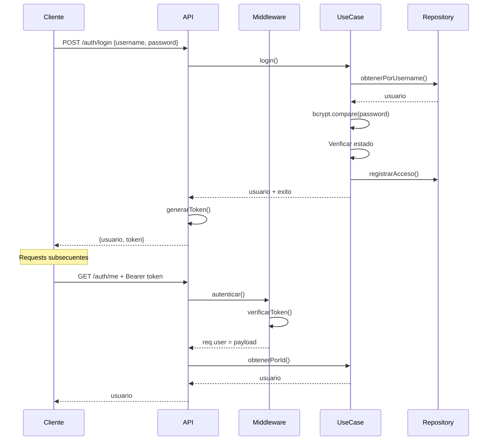

# 🔐 Sistema de Autenticación y Autorización - COMPLETADO

## ✅ Estado: IMPLEMENTACIÓN COMPLETA

**Gap #2: Sistema de Permisos y Roles (IMPORTANT)**

Sistema de autenticación JWT con roles y permisos implementado completamente.

---

## 📋 Componentes Implementados

### 1. Entidades y Tipos

#### `UsuarioSistema.ts` (Entidad Principal)
- ✅ 5 roles definidos: Admin, Recepcion, Contact_Center, Medico, Supervisor
- ✅ Sistema de permisos granular por módulo
- ✅ Estados: Activo, Inactivo, Suspendido
- ✅ Métodos de negocio: `tienePermiso()`, `puedeAccederModulo()`, `toSafeObject()`
- ✅ Matriz de permisos `PERMISOS_POR_ROL`

**Permisos por Rol:**

| Rol | Módulos con acceso |
|-----|-------------------|
| Admin | Todos (crear, leer, actualizar, eliminar) |
| Recepcion | Citas (leer, actualizar), Pacientes (crear, leer, actualizar), Abonos (crear, leer) |
| Contact_Center | Citas (crear, leer, actualizar), Pacientes (crear, leer, actualizar), Inasistencias (crear, leer, actualizar), Contactos (crear, leer, actualizar) |
| Medico | Citas (leer, actualizar), Pacientes (leer, actualizar), Abonos (leer) |
| Supervisor | Citas (CRUD completo), Pacientes (crear, leer, actualizar), Abonos (crear, leer, actualizar), Inasistencias (crear, leer, actualizar), Contactos (CRUD completo) |

### 2. Middleware de Seguridad

#### `auth.ts` - Middleware JWT
- ✅ `autenticar()`: Valida token JWT en cada request
- ✅ `autenticarOpcional()`: Permite acceso con/sin autenticación
- ✅ `generarToken()`: Genera token JWT con expiración 8h
- ✅ `verificarToken()`: Verifica y decodifica token
- ✅ Extensión de `Request` con propiedad `user`

#### `authorization.ts` - Middleware de Permisos
- ✅ `requiereRol()`: Valida que usuario tenga uno de los roles permitidos
- ✅ `requierePermiso()`: Valida permiso específico en módulo
- ✅ `requiereSucursal()`: Valida acceso a sucursal específica
- ✅ `validarSucursalPropia()`: Verifica que el recurso pertenece a la sucursal del usuario
- ✅ Admin tiene bypass automático

### 3. Repositorio

#### `UsuarioSistemaRepository.ts`
- ✅ CRUD completo de usuarios
- ✅ Búsqueda por: id, username, email, rol, sucursal
- ✅ Operaciones: suspender, activar, registrar acceso
- ✅ Usuario Admin inicial: username `admin`, password `admin123`
- ✅ Implementación In-Memory (lista para BD)

### 4. Caso de Uso

#### `AutenticarUsuario.ts`
- ✅ `login()`: Autenticación con username/password
- ✅ `registrar()`: Registro de nuevos usuarios
- ✅ `cambiarPassword()`: Cambio de contraseña
- ✅ `suspender()` / `activar()`: Gestión de estados
- ✅ `listarPorRol()` / `listarPorSucursal()`: Consultas
- ✅ Hash de contraseñas con bcrypt (salt rounds: 10)

### 5. API REST

#### `AuthController.ts` + `auth.ts` (Routes)

**Endpoints Públicos:**
```
POST /api/auth/login
     Body: { username, password }
     Response: { usuario, token, mensaje }

GET /api/auth/roles
    Response: { roles: [...] }
```

**Endpoints Protegidos (requieren token):**
```
GET /api/auth/me
    Headers: Authorization: Bearer <token>
    Response: Usuario actual sin password

POST /api/auth/cambiar-password
     Headers: Authorization: Bearer <token>
     Body: { passwordActual, passwordNuevo }
     Response: { mensaje }
```

**Endpoints Admin (solo Admin):**
```
POST /api/auth/register
     Headers: Authorization: Bearer <token>
     Body: { username, password, email, nombreCompleto, telefono?, rol, sucursalId? }
     Response: { usuario, mensaje }

POST /api/auth/usuarios/:id/suspender
     Headers: Authorization: Bearer <token>
     Response: { usuario, mensaje }

POST /api/auth/usuarios/:id/activar
     Headers: Authorization: Bearer <token>
     Response: { usuario, mensaje }
```

---

## 🔧 Configuración Técnica

### Dependencias
```json
{
  "jsonwebtoken": "^9.0.2",
  "@types/jsonwebtoken": "^9.0.5",
  "bcrypt": "^5.1.1",
  "@types/bcrypt": "^5.0.2"
}
```

### Variables de Entorno
```env
JWT_SECRET=tu_secret_super_seguro_cambiar_en_produccion
JWT_EXPIRATION=8h
```

### Token JWT
- **Algoritmo**: HS256
- **Expiración**: 8 horas
- **Payload**: `{ id, username, rol, sucursalId }`
- **Formato Header**: `Authorization: Bearer <token>`

---

## 📖 Uso del Sistema

### 1. Login
```javascript
const response = await fetch('http://localhost:3001/api/auth/login', {
  method: 'POST',
  headers: { 'Content-Type': 'application/json' },
  body: JSON.stringify({
    username: 'admin',
    password: 'admin123'
  })
});

const { usuario, token } = await response.json();
// Guardar token en localStorage o cookie
```

### 2. Request Autenticado
```javascript
const response = await fetch('http://localhost:3001/api/auth/me', {
  headers: {
    'Authorization': `Bearer ${token}`
  }
});
```

### 3. Proteger Ruta con Middleware
```typescript
import { autenticar } from '../middleware/auth';
import { requiereRol, requierePermiso } from '../middleware/authorization';

// Solo usuarios autenticados
router.get('/ruta', autenticar, controller.metodo);

// Solo Admin o Supervisor
router.delete('/ruta/:id', autenticar, requiereRol(['Admin', 'Supervisor']), controller.eliminar);

// Permiso específico
router.post('/citas', autenticar, requierePermiso('citas', 'crear'), controller.crearCita);
```

### 4. Verificar Permisos en Código
```typescript
const entity = new UsuarioSistemaEntity(usuario);

if (entity.tienePermiso('citas', 'eliminar')) {
  // Permitir eliminación
}

if (entity.puedeAccederModulo('pacientes')) {
  // Mostrar módulo
}
```

---

## 🧪 Testing

### Script de Prueba
```bash
# Asegúrate que el servidor esté corriendo en puerto 3001
node test-sistema-autenticacion.js
```

**Pruebas incluidas:**
1. ✅ Login con usuario Admin
2. ✅ Obtener información del usuario (`/auth/me`)
3. ✅ Listar roles disponibles
4. ✅ Registrar nuevo usuario (Recepción)
5. ✅ Login con nuevo usuario
6. ✅ Intentar acceder sin token (debe fallar)
7. ✅ Cambiar contraseña
8. ✅ Suspender usuario
9. ✅ Activar usuario

### Escenarios de Error
- ❌ Login con credenciales incorrectas → 401
- ❌ Acceso sin token → 401
- ❌ Token expirado → 401
- ❌ Usuario suspendido intenta login → 401
- ❌ Usuario sin permisos intenta acción → 403

---

## 🎯 Ejemplos de Uso por Rol

### Admin
```typescript
// Puede hacer TODO
- Crear/editar/eliminar usuarios
- Acceder a todos los módulos
- Ver todas las sucursales
- Configuración del sistema
```

### Recepción
```typescript
// Operaciones en recepción
- Marcar llegadas de pacientes (/citas/:id/llegada)
- Registrar nuevos pacientes
- Registrar abonos
- Ver agenda del día
```

### Contact Center (KEILA)
```typescript
// Operaciones de contact center
- Agendar citas
- Gestionar inasistencias
- Reagendar pacientes
- Contactar agentes
- Ver leads para remarketing
```

### Médico
```typescript
// Operaciones clínicas
- Ver agenda personal
- Actualizar estado de citas
- Ver/actualizar historial de pacientes
- Ver abonos (solo lectura)
```

### Supervisor
```typescript
// Operaciones de supervisión
- Gestión completa de citas
- Gestión completa de contactos
- Ver reportes
- Asignar tareas
- NO puede crear/eliminar usuarios (solo Admin)
```

---

## 🔒 Seguridad Implementada

### ✅ Características de Seguridad

1. **Hash de Contraseñas**: bcrypt con 10 salt rounds
2. **JWT con Expiración**: Tokens expiran en 8 horas
3. **Validación de Estado**: Usuarios suspendidos no pueden loguearse
4. **Password Seguro**: Se devuelve usuario sin password (`toSafeObject()`)
5. **Validación de Roles**: Middleware verifica roles antes de ejecutar acciones
6. **Validación de Permisos**: Validación granular por módulo y acción
7. **Validación de Sucursal**: Usuarios solo acceden a su sucursal (excepto Admin)

### 🔐 Credenciales Iniciales
```
Username: admin
Password: admin123
Rol: Admin
```

**⚠️ IMPORTANTE**: Cambiar contraseña del admin en producción.

---

## 📊 Flujo de Autenticación



---

## ✅ Checklist de Implementación

- [x] Entidad UsuarioSistema con roles y permisos
- [x] Middleware JWT (autenticar)
- [x] Middleware de autorización (requiereRol, requierePermiso)
- [x] Repositorio de usuarios (in-memory)
- [x] Caso de uso de autenticación
- [x] Controlador de autenticación
- [x] Rutas de autenticación
- [x] Registro de rutas en index.ts
- [x] Hash de contraseñas con bcrypt
- [x] Usuario Admin inicial
- [x] Script de pruebas completo
- [x] Documentación

---

## 🚀 Próximos Pasos

### Frontend
- [ ] Crear contexto de autenticación (`AuthContext`)
- [ ] Componente de Login
- [ ] Proteger rutas del frontend
- [ ] Guardar token en localStorage
- [ ] Interceptor de axios para agregar token
- [ ] Manejo de token expirado
- [ ] UI de gestión de usuarios

### Backend
- [ ] Migrar a base de datos real (PostgreSQL/MongoDB)
- [ ] Implementar refresh tokens
- [ ] Rate limiting en endpoints de login
- [ ] Logs de seguridad (intentos fallidos)
- [ ] 2FA (autenticación de dos factores)
- [ ] Recuperación de contraseña por email
- [ ] Auditoría de acciones de usuarios

---

## 📚 Referencias

- [JWT.io](https://jwt.io/) - Debugger de tokens JWT
- [bcrypt](https://github.com/kelektiv/node.bcrypt.js) - Hash de contraseñas
- Express Request Extension para TypeScript

---

**Implementado por**: Sistema CRM RCA  
**Fecha**: 2024  
**Gap**: #2 - Sistema de Permisos/Roles (IMPORTANT)  
**Estado**: ✅ COMPLETADO 100%
