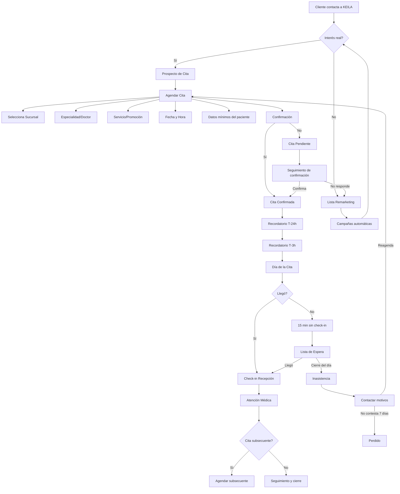

# Proceso de Atención a Clientes RCA (Demo)

Este documento define el flujo operativo y las reglas completas para una versión demo del CRM RCA.

## Diagrama de flujo

## Reglas completas (versión demo)

### 1) Estados y transiciones
- **Lead**: contacto inicial por cualquier canal.
- **Prospecto**: interés confirmado con datos mínimos.
- **Cita Pendiente**: cita creada sin confirmación.
- **Cita Confirmada**: respuesta “Sí” del paciente.
- **En espera**: 15 minutos sin check-in.
- **Inasistencia**: no llegó al cierre del día.
- **Perdido**: 7 días sin respuesta tras inasistencia.
- **Atendido**: check-in completado y consulta realizada.
- **Seguimiento**: postconsulta, reactivación o nuevas campañas.

### 2) Reglas de agenda
- **Empalmes permitidos**: hasta N citas por hora y por médico (demo: 3).
- **Promociones**: si la cita es por promoción, solo 1 re-agendo con promoción.
- **2da re-agenda**: se mantiene la cita pero **sin promoción**.
- **Cita subsecuente**: puede quedar sin horario fijo y se atiende por llegada.

### 3) Confirmación y recordatorios
- **Confirmación**: al crear la cita se envía mensaje multicanal.
- **T‑24h**: se solicita confirmación de asistencia.
- **T‑3h**: recordatorio final.
- **No respuesta**: se mantiene “Pendiente” y entra en seguimiento.

### 4) Check-in y tolerancia
- **Llegada**: recepción marca “Llegó”.
- **Tolerancia**: a los 15 minutos sin check-in pasa a “En espera”.
- **Cierre**: al terminar el día, las citas en espera pasan a “Inasistencia”.

### 5) Inasistencias y pérdidas
- **Inasistencia**: genera registro con motivo.
- **Catálogo de motivos** (demo): trabajo, enfermedad, olvido, sin transporte, otro.
- **Reagenda**: sale de inasistencia si programa nueva cita.
- **Perdido**: 7 días sin respuesta posterior al contacto.

### 6) Contacto y canal
- **Canales**: WhatsApp, teléfono, email, redes sociales.
- **Preferencia**: se respeta canal preferido del paciente.
- **Escalamiento**: WhatsApp → llamada → email si no responde.

### 7) Roles y permisos (demo)
- **Keila / Contact Center**: crear lead, agendar, confirmar, reagendar.
- **Recepción**: check-in, lista de espera, inasistencia.
- **Médico**: registrar atención y subsecuentes.
- **Admin**: reglas, promociones, empalmes y catálogos.

### 8) Campañas y segmentación
- **Segmentos**: nunca atendidos, atendidos 1 vez, múltiples asistencias.
- **Campañas**: automatizadas (remarketing) y esporádicas (promo).
- **Acciones**: mensajes, seguimiento, reactivación.

### 9) Datos obligatorios (demo)
- **Mínimos**: nombre, teléfono, sucursal, servicio, fecha/hora.
- **Opcionales**: correo, afiliación, religión, edad.
- **Consentimientos**: registro explícito para contacto y tratamiento de datos.

### 10) KPIs sugeridos
- **Tasa de confirmación** = confirmadas / agendadas.
- **Show rate** = atendidas / confirmadas.
- **No‑show rate** = inasistencias / confirmadas.
- **Conversión** = citas / leads.
- **Tiempo promedio a cita** = fecha cita − fecha lead.

## Notas para demo
- Datos simulados y mensajes mock visibles.
- Las reglas se muestran en el dashboard como “activas”.
- Cada transición cambia automáticamente las listas inteligentes.
