# 07 – Diagramas de flujo del sistema

Este documento contiene **diagramas de flujo** para que cualquier persona (desarrollador o no) entienda cómo funciona el sistema: desde que llega un lead hasta que se convierte en paciente atendido, y qué pasa con las citas y la recepción.

---

## Para qué sirven estos diagramas

- **Entender el flujo completo:** ver de un vistazo qué pasos sigue un lead o una cita.
- **Comunicar con el equipo:** explicar el sistema sin entrar en detalles técnicos.
- **Formar a nuevos usuarios:** recepción, contact center y administración pueden seguir los flujos en pantalla.
- **Desarrollo y pruebas:** el desarrollador sabe en qué orden y en qué módulos se usa cada flujo.

---

## 1. Flujo general: del lead a la conversión

Desde que una persona muestra interés (por WhatsApp, redes o teléfono) hasta que asiste a la cita y se considera **convertida**.

```mermaid
flowchart LR
  A[Persona interesada] --> B[Llega por WhatsApp / Redes / Teléfono]
  B --> C[Asesor la contacta]
  C --> D[Conversación en Keila IA]
  D --> E[Se agenda una cita]
  E --> F[Paciente recibe recordatorios]
  F --> G[Asiste el día de la cita]
  G --> H[Recepción marca llegada]
  H --> I[Pasa a consultorio]
  I --> J[Se atiende y finaliza]
  J --> K[Lead convertido]
```

**En pocas palabras:** La persona entra por algún canal → el asesor la contacta y habla con ella → se agenda una cita → el paciente recibe recordatorios → asiste → en Recepción se marca llegada, se pasa a consultorio y se finaliza → el lead queda **convertido**.

---

## 2. Ciclo de vida del lead (con ramas)

Qué puede pasar con un lead: desde que entra al sistema hasta que se convierte, se pierde o queda pendiente.

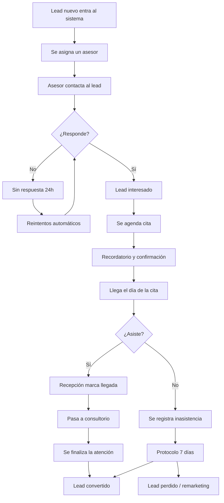

**En pocas palabras:** Al lead se le asigna asesor y se le contacta. Si no responde, hay reintentos. Si responde, se agenda cita; el día de la cita puede asistir (y se convierte) o no asistir (inasistencia y protocolo de 7 días, que puede terminar en convertido o perdido).

---

## 3. Día a día en Recepción

Qué hace Recepción con cada cita del día: desde que el paciente llega hasta que sale del consultorio.

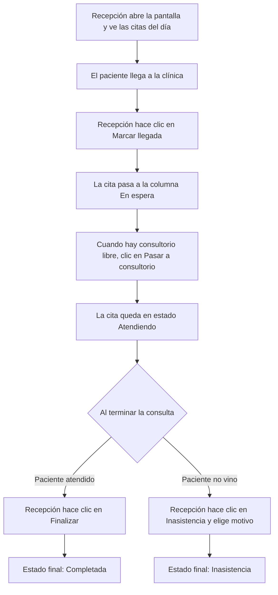

**En pocas palabras:** Recepción ve las citas del día, marca llegada cuando el paciente llega, lo pasa a consultorio cuando corresponde, y al terminar hace “Finalizar” o “Inasistencia” según el caso.

---

## 4. Ciclo de vida de una cita

Desde que se agenda la cita hasta que queda completada o inasistencia (sin entrar en detalle técnico de schedulers).

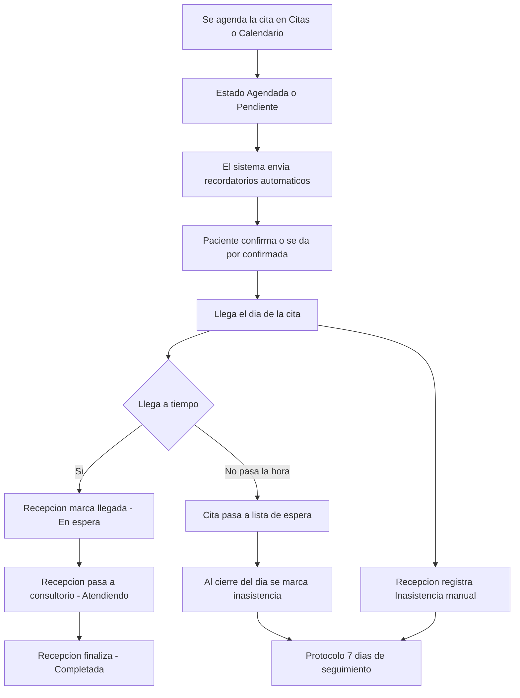

**En pocas palabras:** Se agenda → recordatorios → día de la cita. Si llega a tiempo, pasa por En espera → Atendiendo → Completada. Si no llega o no viene, se registra inasistencia y corre el protocolo de 7 días.

---

## 5. Qué pasa cuando el paciente no asiste (protocolo 7 días)

Flujo simplificado del seguimiento automático tras una inasistencia.

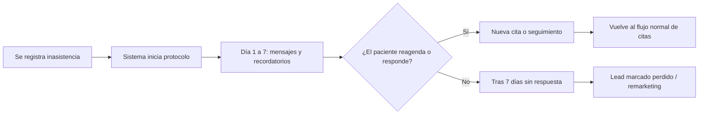

**En pocas palabras:** Si el paciente no asiste, el sistema intenta contactarlo durante 7 días. Si reagenda o responde, se sigue el flujo normal. Si no, el lead se considera perdido y puede usarse para remarketing.

---

## 6. Open Ticket: de solicitud a cita

Cuando hay una solicitud de cita aún sin fecha (ticket abierto) y qué se puede hacer con ella.

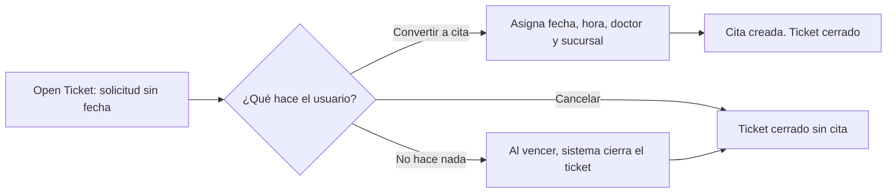

**En pocas palabras:** Un Open Ticket es una solicitud de cita sin fecha. Se puede convertir en cita (asignando día y hora), cancelar o dejar que expire; en todos los casos el ticket se cierra.

---

## 7. Lista de espera automática

Qué hace el sistema cuando pasó la hora de la cita y el paciente no ha llegado.

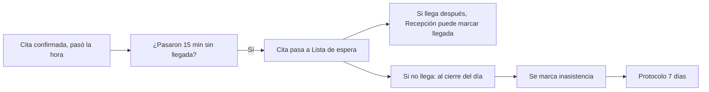

**En pocas palabras:** Si a los 15 minutos no hay llegada, la cita pasa a lista de espera. Si el paciente llega después, se puede marcar llegada; si no, al cierre del día se registra inasistencia y se aplica el protocolo de 7 días.

---

## 8. Arquitectura Multi-Sucursal WhatsApp

Cada sucursal tiene su **propia configuración de WhatsApp** (número, token, WABA). Cuando Meta envía un webhook, el sistema identifica la sucursal por `phone_number_id` y enruta el mensaje solo a los agentes de esa sucursal.

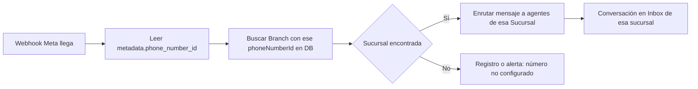

**En pocas palabras:** Cada sucursal tiene su propia configuración de WhatsApp (phoneNumberId, accessToken, wabaId). Cuando llega un webhook, el sistema identifica la sucursal por phone_number_id y solo los agentes de esa sucursal ven la conversación.

---

## 9. Pipeline Contact Center: columnas del Kanban

Máquina de estados del lead: columnas **Leads WhatsApp**, **Agendado**, **Confirmado**, **Pagado/Cerrado**, **Remarketing**, **No Asistió**. Los KPIs (Confirmación, Ingresos) se incrementan al pasar a Confirmado o Cerrado.

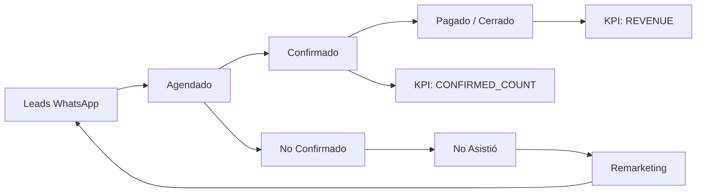

**En pocas palabras:** El lead entra en Leads WhatsApp; si se agenda pasa a Agendado. Al confirmar (manual o bot) va a Confirmado (incrementa KPI). Pagado/Cerrado incrementa ingresos. No confirmados que pasan la fecha van a No Asistió (cron) y luego a Remarketing.

---

## 10. Cron: No Confirmado → No Asistió

Tarea programada (**MarkNoShowsScheduler**) que corre cada hora: busca citas con fecha ya pasada y estado *No confirmado*, actualiza el lead a **No Asistió** y lo añade a la **lista de recuperación**.

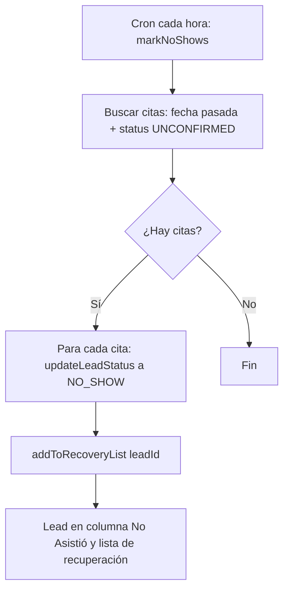

**En pocas palabras:** Cada hora el sistema busca citas ya pasadas que no fueron confirmadas, actualiza el estado del lead a No Asistió y lo añade a la lista de recuperación para que Recepción pueda contactar y reagendar.

---

## 11. Reagendar desde lista No Asistió

En el **módulo Recepción**, la **Lista de Recuperación** muestra una tabla (Data Grid) de quienes no asistieron. Botón **Reagendar** abre el modal de calendario con datos del paciente pre-llenados; al guardar, el estado pasa a *RESCHEDULED* y el lead se mueve en el Kanban.

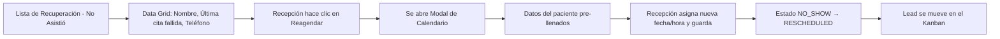

**En pocas palabras:** En el módulo Recepción, la lista de recuperación muestra quienes no asistieron. Al clic en Reagendar se abre el mismo modal de citas con datos pre-llenados; al guardar el lead pasa a reagendado y se actualiza el Kanban.

---

## 12. Cuidados Espirituales: asistencia y agendamiento

Servicio adicional en la clínica: en el **sidebar del Chat/Perfil** hay una sección **Servicios Adicionales** con la card **Cuidados Espirituales**. Botón para **Marcar Asistencia** (actualiza KPI de atendidos) y agendamiento con `appointment_type = SPIRITUAL` (en calendario se muestran en color violeta).

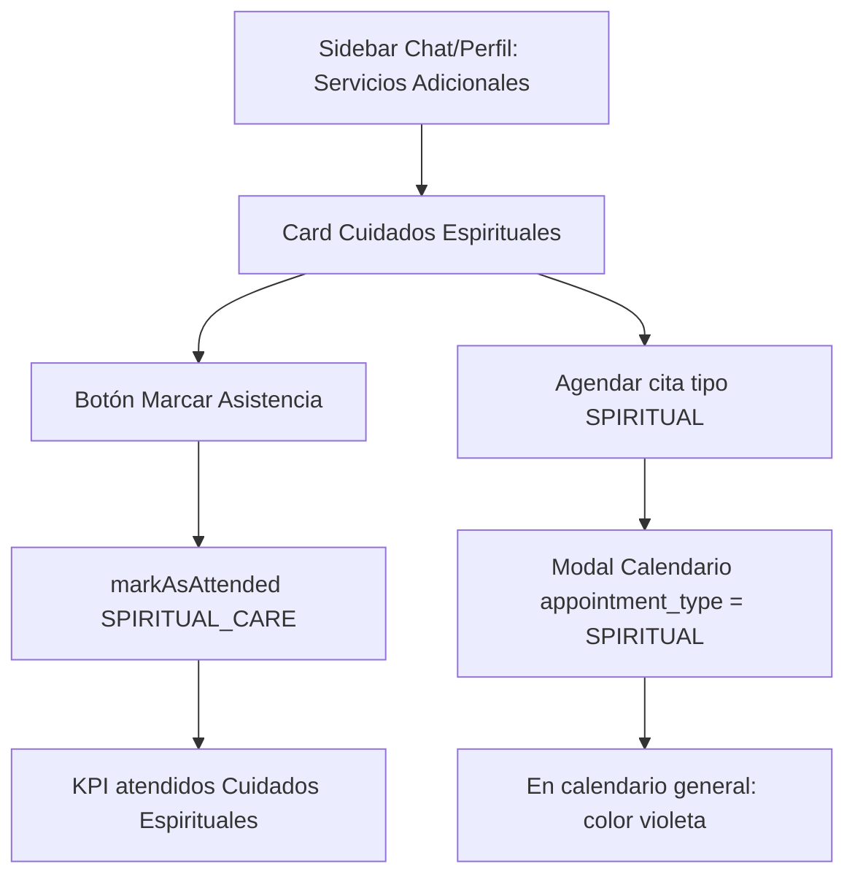

**En pocas palabras:** En el perfil del paciente o chat hay una sección Cuidados Espirituales: botón para marcar asistencia (actualiza KPI) y opción de agendar cita especial; en el calendario estas citas se distinguen por tipo (ej. color violeta).

---

## 13. Encuesta de calidad post-venta

Cuando el lead pasa a **Pagado/Cerrado ganado** (CLOSED_WON o PAYMENT_RECEIVED), el sistema dispara el envío de la **encuesta de calidad** por el canal activo (WhatsApp o Instagram), usando la plantilla `encuesta_calidad_v1` con link al formulario.

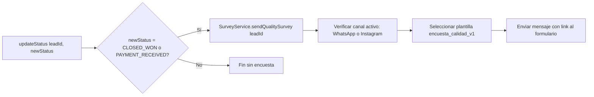

**En pocas palabras:** Cuando el lead pasa a Pagado/Cerrado ganado, el sistema dispara automáticamente el envío de la encuesta de calidad por el canal por el que se contactó (WhatsApp o Instagram), usando la plantilla configurada.

---

## Resumen: módulos que intervienen en cada flujo

| Flujo | Dónde se ve / se usa |
|-------|----------------------|
| Lead → conversión | CRM, Keila IA (Matrix), Citas, Recepción |
| Ciclo del lead (ramas) | CRM, Keila IA, Citas, Recepción, automatizaciones |
| Recepción día a día | Módulo Recepción |
| Ciclo de la cita | Citas, Calendario, Recepción, recordatorios automáticos |
| Protocolo inasistencia | Recepción (registro), automatizaciones (7 días) |
| Open Ticket | Citas (vista de tickets) |
| Lista de espera | Recepción, Citas, cierre de día automático |
| Multi-Sucursal WhatsApp | Backend webhook, Configuración por sucursal, Inbox Matrix por sucursal |
| Pipeline Kanban (columnas) | CRM, Keila IA (Kanban), Contact Center |
| No Confirmado → No Asistió | MarkNoShowsScheduler (cron cada hora), lista de recuperación |
| Reagendar desde No Asistió | Recepción (Lista de Recuperación), modal Citas |
| Cuidados Espirituales | Keila IA (sidebar perfil/chat), Calendario (tipo SPIRITUAL) |
| Encuesta post-venta | Backend (SurveyService al cerrar/recibir pago), canales WhatsApp/Instagram |

Para el detalle de cada pantalla y botón, ver [02 - Módulos](02-MODULOS/). Para el detalle de los procesos en texto, ver [04 - Procesos de negocio](04-PROCESOS-DE-NEGOCIO.md).

---

*Manual CRM RCA – Versión 1.0 – Febrero 2026.*
